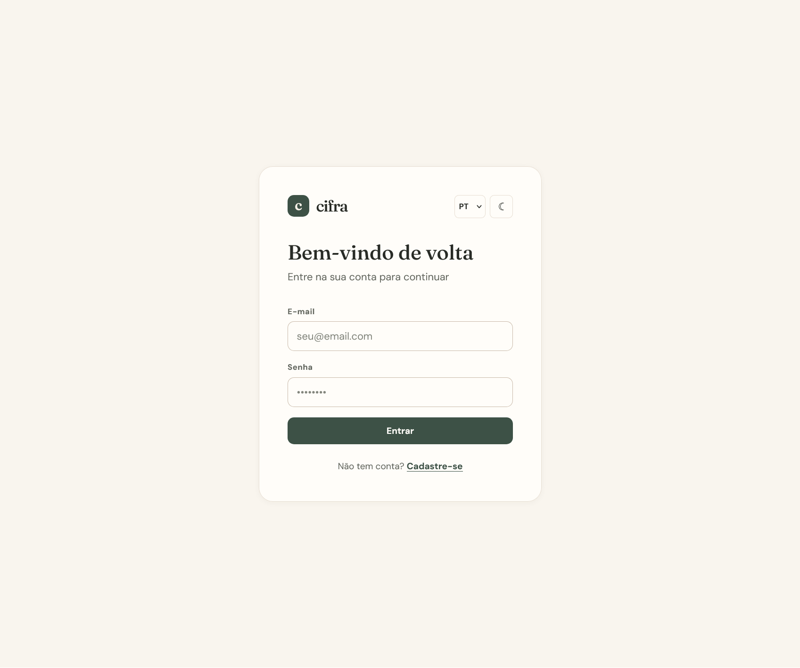
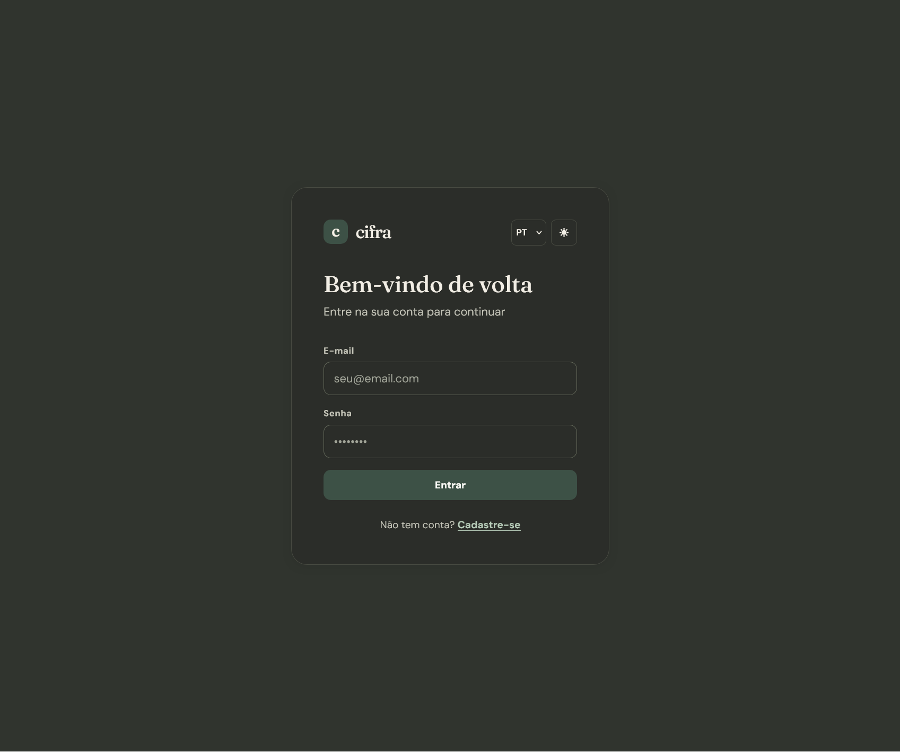
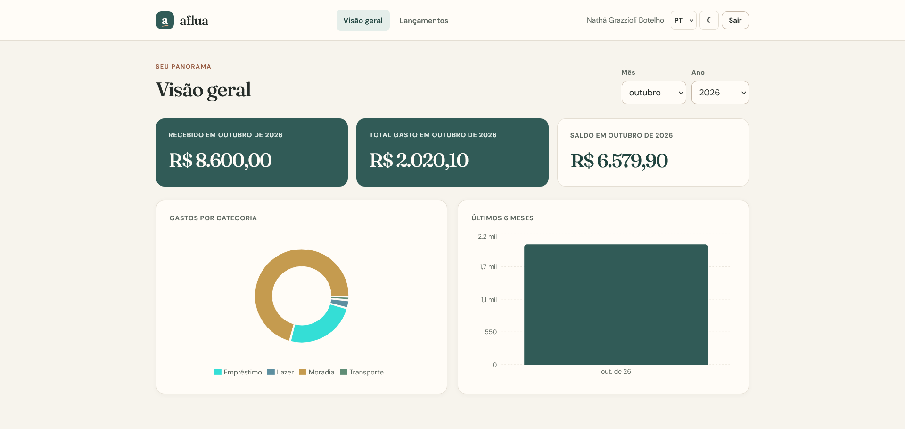
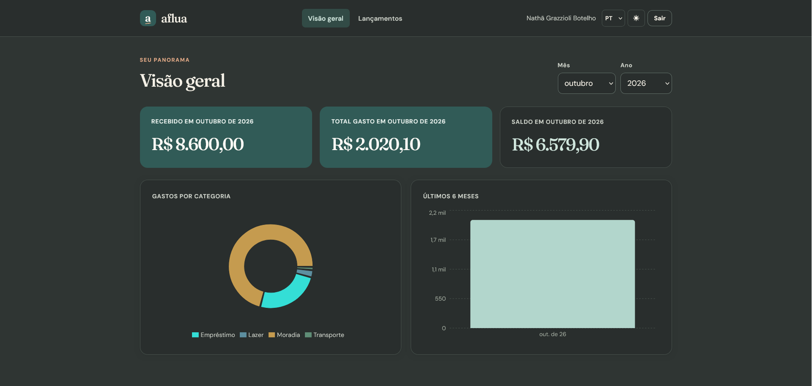
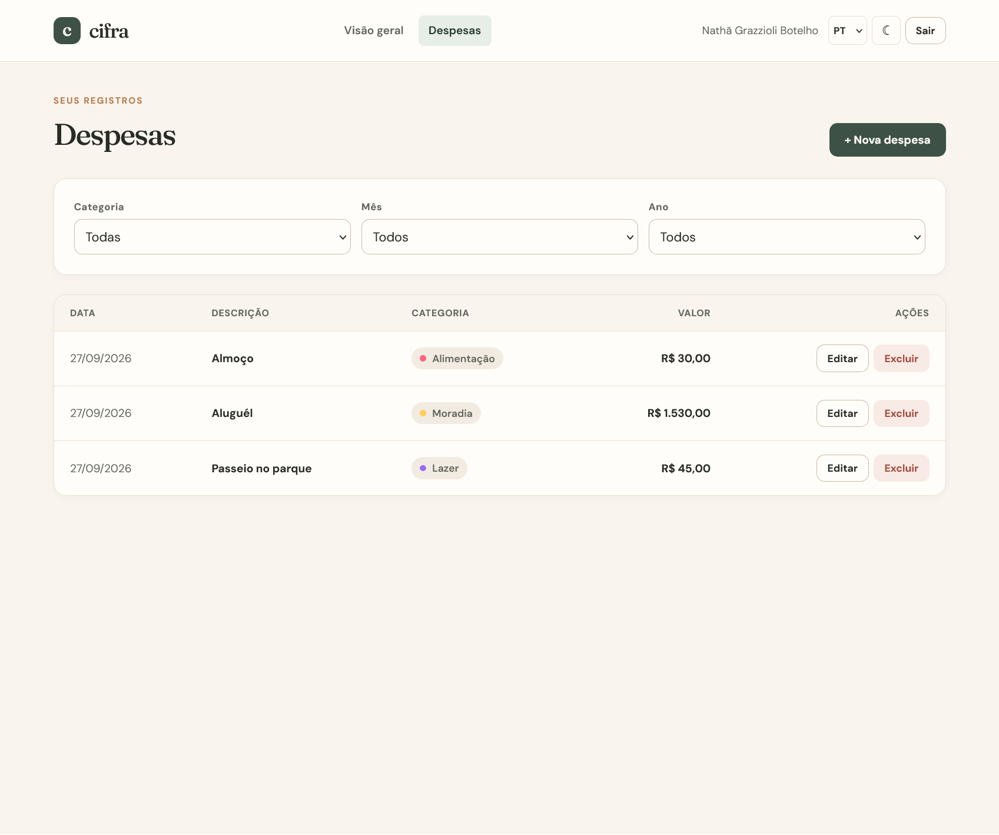
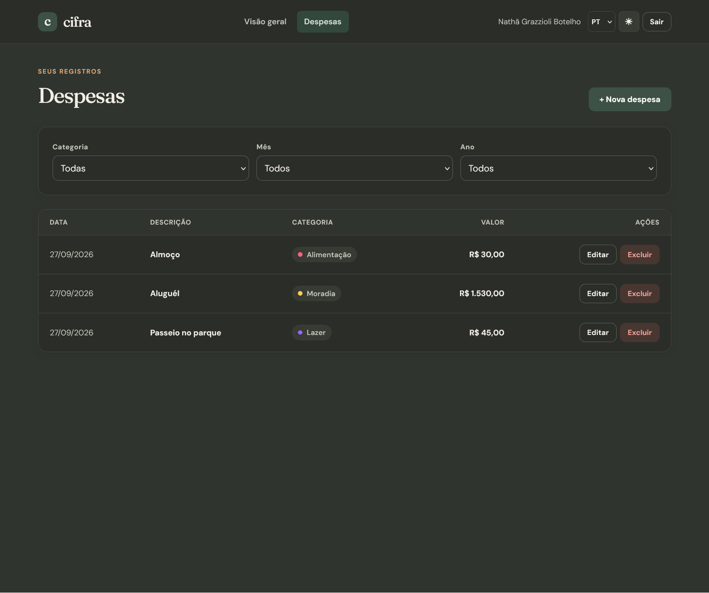
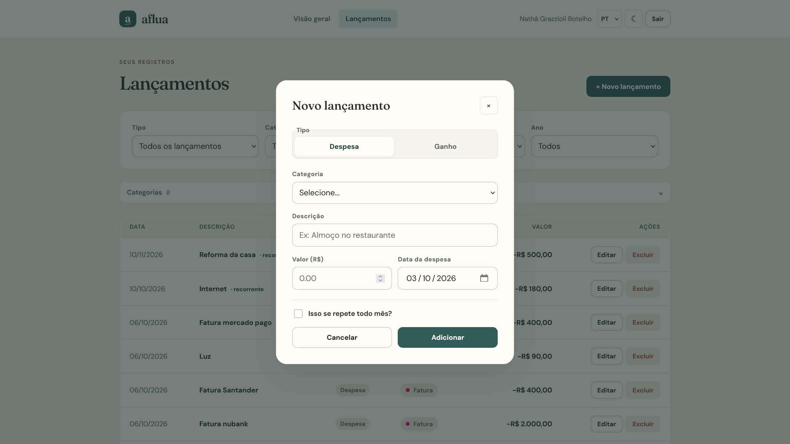
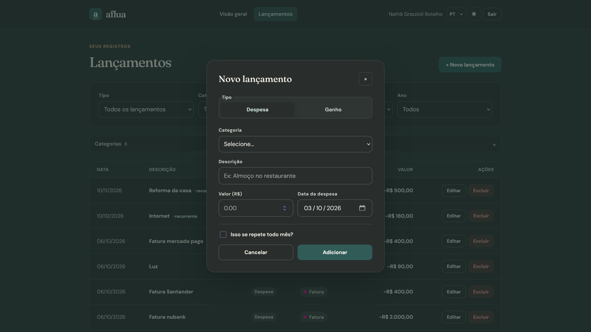

# aflua

**A personal finance tracker built with Laravel and React.** Aflua helps people record expenses, organize their own categories, and understand spending through a monthly dashboard. This portfolio project began as Expense Tracker, gained a bilingual and more considered interface under the name cifra, and now evolves into aflua: a product identity inspired by the movement of money in and out.

The `expense-tracker-api` and `expense-tracker-frontend` directories retain their original technical names. The repository name can change independently of these paths; the application itself is branded aflua.

## Product evolution

The first version established the full-stack foundation: Sanctum authentication, protected REST endpoints, expense CRUD, category and date filters, and aggregated dashboard charts. The cifra iteration focused on product design and frontend experience. The current aflua iteration keeps that foundation and adds user-owned, customizable categories as a prerequisite for future cash-flow features.

| Area | Evolution |
| --- | --- |
| Identity | An aflua wordmark and flowing `a` favicon, river-green and warm neutral palette, humanist serif headings, and restrained visual details. |
| Categories | Default categories are cloned on registration and belong to each user; names and colors can be customized without affecting other accounts. |
| Themes | Light mode and a warm graphite dark mode, with the preference saved locally. |
| Language | Complete interface text in Brazilian Portuguese and English, including dates, month names, currency formatting, filters, forms, and charts. |
| Feedback | Loading skeletons, consistent success/error toasts, subtle modal and state transitions, and reduced-motion support. |
| Usability | Keyboard-accessible expense modal with Escape handling and focus management; stale filter responses cannot replace newer results. |

This evolution demonstrates how an existing application can gain a stronger product identity and safer data ownership without a rewrite.

The visual system replaces the original violet, card-heavy UI with a warmer and quieter approach: Fraunces headings, DM Sans body text, paper-like surfaces, a river-green brand color, and a graphite dark theme.

## Interface gallery

| Area | Light theme | Dark theme |
| --- | --- | --- |
| Sign in |  |  |
| Dashboard |  |  |
| Expenses |  |  |
| Add expense |  |  |

## Features

### Authentication

- User registration and login
- Laravel Sanctum token authentication
- Protected frontend routes and authenticated API endpoints

### Expense management

- Create, edit, and delete expenses
- Assign categories, descriptions, amounts, and dates
- Modal-based creation and editing
- Filter by category, month, and year

### Categories

- Default categories cloned into every new account
- User-owned category CRUD with authorization checks
- Editable names and hex colors, used consistently in expense tags and dashboard charts
- Existing expenses preserved when legacy global categories are migrated to individual catalogs
- Deletion of a category with linked expenses is blocked until those expenses are reassigned

### Dashboard analytics

- Total spent in the selected month
- Expense distribution by category
- Spending history for the last six months
- Month and year filters
- Interactive Recharts pie and bar charts

### Interface

- Responsive layout with light and dark themes
- PT-BR and EN language switcher
- Local persistence of language and theme preferences
- Skeleton loading states, operation feedback, and subtle transitions

## Tech stack

| Layer | Technologies |
| --- | --- |
| Frontend | React 19, Vite, React Router, Axios, Context API, Recharts |
| Backend | Laravel 13, Laravel Sanctum, REST API, authorization policies |
| Database | MySQL |

## Project structure

```text
repository-root/
├── expense-tracker-api/
│   ├── app/
│   │   ├── Http/Controllers/       # Auth, categories, expenses, dashboard
│   │   ├── Models/                 # User, Category, Expense
│   │   └── Policies/               # Expense and category authorization
│   ├── database/
│   │   ├── migrations/
│   │   └── seeders/
│   └── routes/api.php
├── expense-tracker-frontend/
│   └── src/
│       ├── api/                    # Axios client and token interceptor
│       ├── components/charts/      # Category and six-month charts
│       ├── components/ui/          # Navigation, language, protected route
│       ├── contexts/               # Authentication and theme
│       ├── hooks/                  # Fetching and form errors
│       ├── i18n/                   # PT-BR / EN translations and formatting
│       └── pages/                  # Auth, dashboard, expenses, modal
└── Screenshots/                   # Aflua light and dark UI captures
```

## Architecture

The React single-page application calls the Laravel REST API through Axios. The client attaches a Sanctum bearer token to authenticated requests. Laravel validates requests, scopes categories and expenses to the authenticated user, applies authorization policies, and reads or writes MySQL data. The dashboard endpoint returns aggregates that Recharts renders in the frontend.

```text
React 19 + Router + Context API + Recharts
                  │ HTTP / JSON
                  ▼
Laravel 13 REST API + Sanctum + Policies
                  │
                  ▼
                MySQL
```

### Data relationships

- A `User` has many `Category` and `Expense` records.
- A `Category` belongs to a user and has many expenses.
- An `Expense` belongs to a user and a category.

Registration creates the user and their default category catalog in one transaction. The ownership migration clones legacy global categories per existing account and remaps historical expenses to the correct copies.

### Dashboard queries

The dashboard uses `SUM()`, `GROUP BY`, and date-based filtering to calculate the selected month's total, spending by category, and the last six months of spending. These results are displayed with Recharts pie and bar charts.

## Engineering concepts

Full-stack development · REST API design · SPA authentication with Sanctum · React Context API · protected routes · custom hooks · CRUD · SQL aggregation · authorization policies · component-based UI · data visualization · internationalization · accessible interaction states.

## Run locally

### Backend

From the repository root:

```bash
cd expense-tracker-api
composer install
cp .env.example .env
```

Configure the MySQL connection in `expense-tracker-api/.env`, then run:

```bash
php artisan key:generate
php artisan migrate --seed
php artisan serve
```

The API runs at `http://localhost:8000` by default.

### Frontend

In a second terminal, from the repository root:

```bash
cd expense-tracker-frontend
npm install
npm run dev
```

The Axios client currently points to `http://localhost:8000/api`.

## Next steps

- Income entries and a realized monthly balance
- Recurring income and expenses with editable confirmation
- Projected cash-flow balance and pending entries
- Budget planning, financial goals, and report exports
- Integration tests for authentication and expense flows
- Pagination and frontend route-level code splitting

## About

Built as a portfolio project to practice Laravel, React, Sanctum authentication, REST APIs, data visualization, and full-stack application architecture. The source code uses English identifiers; the product interface supports Brazilian Portuguese and English.
