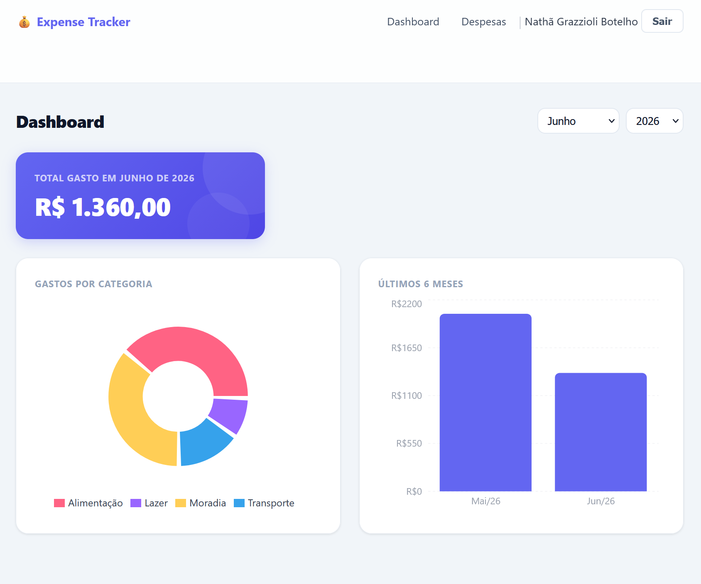
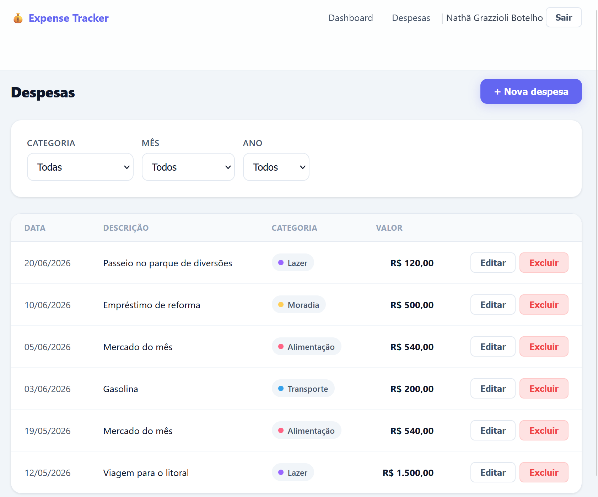

# Expense Tracker

A full-stack expense management application built with Laravel and React. The application allows users to manage personal expenses, organize spending by categories, and analyze financial data through interactive dashboards and charts.

## Features

### Authentication

* User registration
* User login
* Secure authentication using Laravel Sanctum
* Protected routes

### Expense Management

* Create expenses
* Edit expenses
* Delete expenses
* Associate expenses with categories
* Add descriptions and dates
* Modal-based expense creation and editing

### Expense Filtering

* Filter expenses by category
* Filter expenses by month
* Filter expenses by year

### Dashboard Analytics

* Monthly expenses summary
* Expenses grouped by category
* Last 6 months spending history
* Month and year filters
* Interactive charts powered by Recharts

## Tech Stack

### Frontend

* React 19
* Vite
* React Router
* Axios
* Context API
* Recharts

### Backend

* Laravel 13
* Laravel Sanctum
* REST API
* Policies
* API Resources

### Database

* MySQL

## Project Structure

```text
expense-tracker/
│
├── expense-tracker-api/
│   │
│   ├── app/
│   │   ├── Http/
│   │   │   └── Controllers/
│   │   │       ├── AuthController.php
│   │   │       ├── CategoryController.php
│   │   │       ├── DashboardController.php
│   │   │       └── ExpenseController.php
│   │   │
│   │   ├── Models/
│   │   │   ├── Expense.php
│   │   │   └── Category.php
│   │   │
│   │   ├── Policies/
│   │   └── Resources/
│   │
│   ├── database/
│   │   ├── migrations/
│   │   └── seeders/
│   │
│   └── routes/
│       └── api.php
│
└── expense-tracker-frontend/
    │
    └── src/
        │
        ├── api/
        │   └── axios.js
        │
        ├── contexts/
        │   └── AuthContext.jsx
        │
        └── components/
            │
            ├── charts/
            │   ├── ExpensesByCategory.jsx
            │   └── ExpensesLastMonths.jsx
            │
            ├── hooks/
            │   ├── useFetch.js
            │   └── useFormErrors.js
            │
            ├── ui/
            │   ├── Navbar.jsx
            │   └── ProtectedRoute.jsx
            │
            └── pages/
                │
                ├── DashboardPage.jsx
                ├── LoginPage.jsx
                ├── RegisterPage.jsx
                │
                └── expenses/
                    ├── ExpensesPage.jsx
                    └── ExpenseModal.jsx
```

## Architecture

```text
┌─────────────────────────────┐
│      React Frontend         │
├─────────────────────────────┤
│ React 19                    │
│ Vite                        │
│ React Router                │
│ Axios                       │
│ Context API                 │
│ Recharts                    │
└─────────────┬───────────────┘
              │
              │ HTTP Requests
              ▼
┌─────────────────────────────┐
│      Laravel Backend        │
├─────────────────────────────┤
│ REST API                    │
│ Laravel Sanctum             │
│ Authentication              │
│ Policies                    │
│ API Resources               │
└─────────────┬───────────────┘
              │
              ▼
┌─────────────────────────────┐
│          MySQL              │
├─────────────────────────────┤
│ users                       │
│ categories                  │
│ expenses                    │
│ personal_access_tokens      │
└─────────────────────────────┘
```

## Database Relationships

```text
User
├── hasMany Categories
└── hasMany Expenses

Category
├── belongsTo User
└── hasMany Expenses

Expense
├── belongsTo User
└── belongsTo Category
```

## Dashboard Analytics

The dashboard uses aggregated queries and data visualization to provide meaningful insights about user spending.

Metrics include:

* Total expenses for the selected month
* Expense distribution by category
* Spending history for the last six months

Implemented using:

* SUM()
* GROUP BY
* Date-based filtering
* Recharts Pie Charts
* Recharts Bar Charts

## Concepts Practiced

* Full-Stack Development
* RESTful API Design
* SPA Authentication with Sanctum
* React Context API
* Protected Routes
* Custom React Hooks
* CRUD Operations
* Data Aggregation
* SQL Queries
* Authorization Policies
* API Resources
* Component-Based Architecture
* Data Visualization

## Installation

### Backend

```bash
cd expense-tracker-api

composer install

cp .env.example .env

php artisan key:generate

php artisan migrate --seed

php artisan serve
```

### Frontend

```bash
cd expense-tracker-frontend

npm install

npm run dev
```

## Screenshots

### Login


### Dashboard



### Expenses



## Notes

The application's user interface and comments are written in Brazilian Portuguese (pt-BR).

Source code follows English naming conventions for variables, functions, components, and API endpoints to improve readability and maintainability.

## Future Improvements

* Budget planning
* Financial goals
* Recurring expenses
* Export reports
* Dark mode
* Advanced financial analytics

## Author

Developed as a portfolio project to practice Laravel, React, Sanctum authentication, REST APIs, data visualization, and full-stack application architecture.
